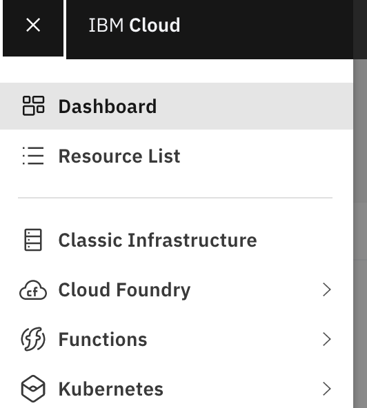
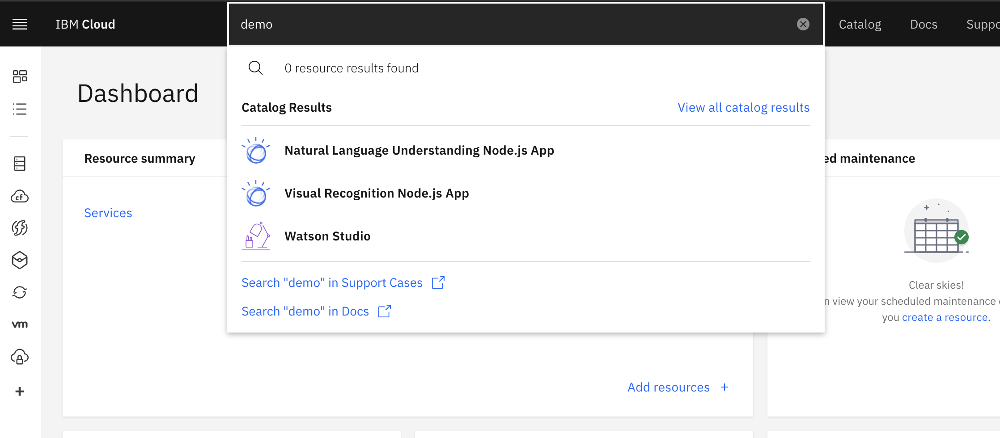
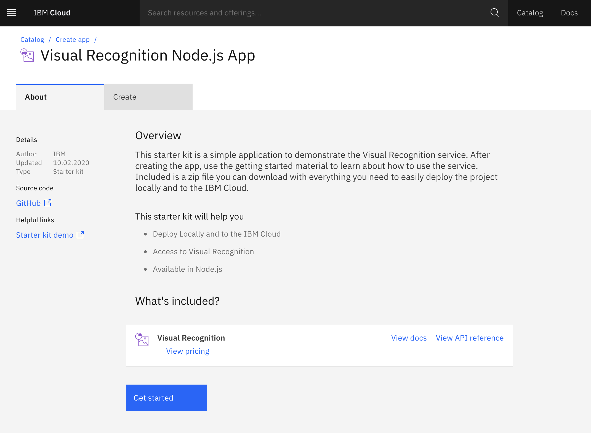
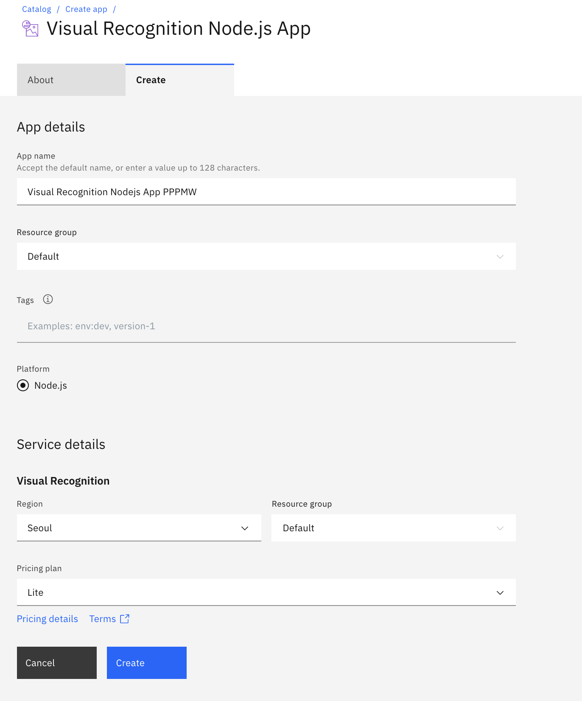
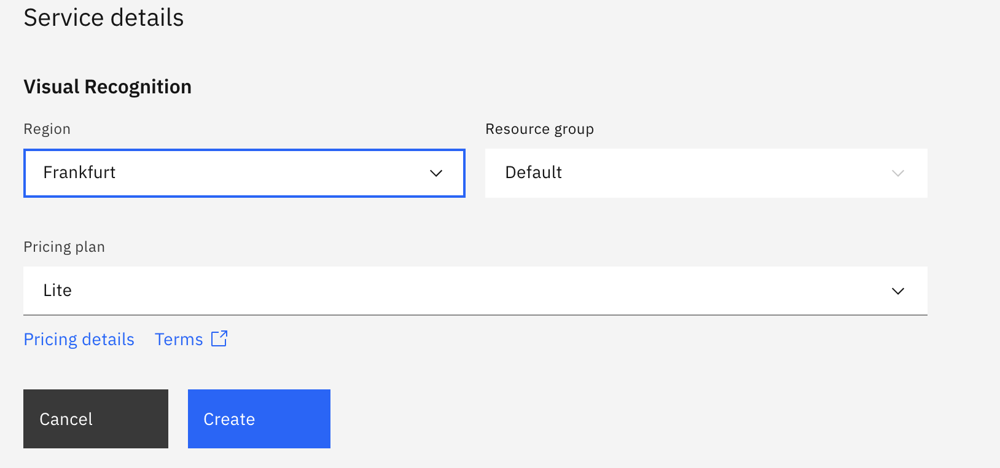
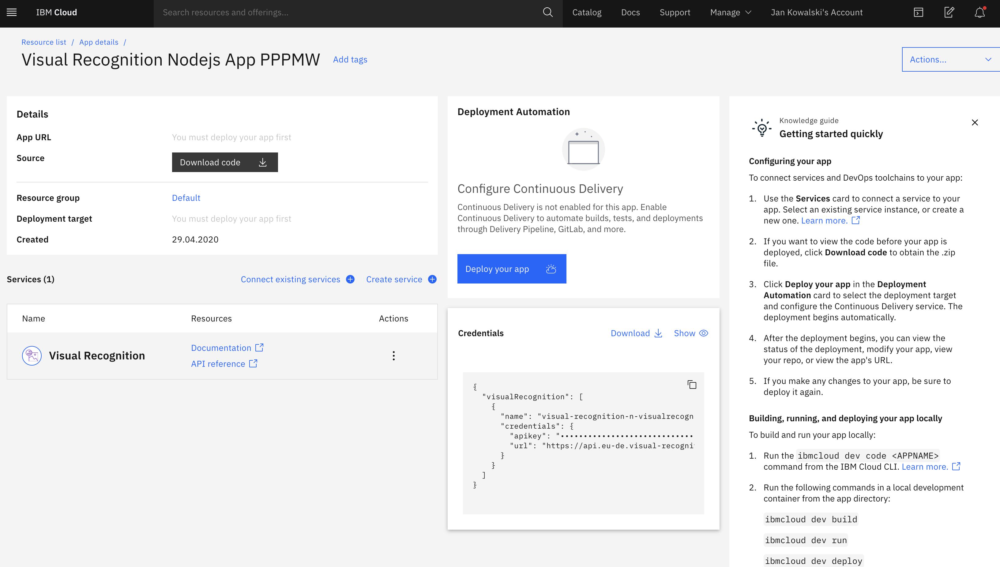

# Lab: Creating Visual Recognition App on IBM Cloud

&nbsp;
&nbsp;
&nbsp;
&nbsp;
Wanna return to the agenda page?  [CLICK HERE](../README.md)
&nbsp;
&nbsp;
&nbsp;
&nbsp;
&nbsp;
&nbsp;

&nbsp;
&nbsp;
> IMPORTANT: The most important thing for you right now is to take your time and do not rush through the scripts. Rather, try to understand new concepts and let them sink in. You can finish the lab during the workshop but if don't it's OK. You will be able to finish it later.  You can also continue with other labs that you find on the way. This is how any skill is built - by doing. 
&nbsp;
&nbsp;
&nbsp;
&nbsp;
# 1. Creating Visual Recognition App on IBM Cloud

Prerequisites for this lab are:

- [ ] Existing **IBM Cloud** account 

- [ ] Started instance of **Watson Studio** on your **IBM Cloud** account 

IBM Cloud has several demonstration apps that you just need to find and start. Visual Recognition app will give you a chance to see how deployed model is connecting with cloud native www application. You can explore and tinker with it, this is what this app was created for :)

> If you haven't registered to IBM Cloud or haven't started Watson Studio intance, please proceed to Preparation Lab.

Navigate to your dashboard on IBM Cloud. You can use first icon on the vertical menu on the left.
&nbsp;
&nbsp;
 
&nbsp;
&nbsp;

Right now Click on the search pane and write **"demo"**. You should see a 'Visual Recognition Node.js App' (among other things).
&nbsp;
&nbsp;
 
&nbsp;
&nbsp;
Click on that app. You will get to a page descibing what is exaclty started.
&nbsp;
> Note that first instance Visual Recognition service is free, so you don't have to worry about any charges. This rule applies to majority of services available on IBM Cloud. First service comes for free on a Lite  
&nbsp;
&nbsp;
 
&nbsp;
&nbsp;
Click 'Get Started'. You are redirected to a page creating your free Visual Recognition instance.

&nbsp;
&nbsp;
 
&nbsp;
&nbsp;
Now you need to choose a region and a pricing plan for your newly created app. For a pricing plan ensure that you are on Lite. Then click 'Create' button.

&nbsp;
> Note that your instance will be created in one of IBM Cloud regions. You can choose a region (which means data center for your app or data) that is close to you and is located within the boundaries of Europen Union. In that case no data will leave EU.
&nbsp;
&nbsp;
&nbsp;
 
&nbsp;
&nbsp;

Now your are ready to deploy your app. Click 'Deploy you app' button. A lot of thing will happen in the backgound.

&nbsp;
&nbsp;
 
&nbsp;
&nbsp;

&nbsp;
&nbsp;
&nbsp;
&nbsp;
# End of Visual Recognition Lab