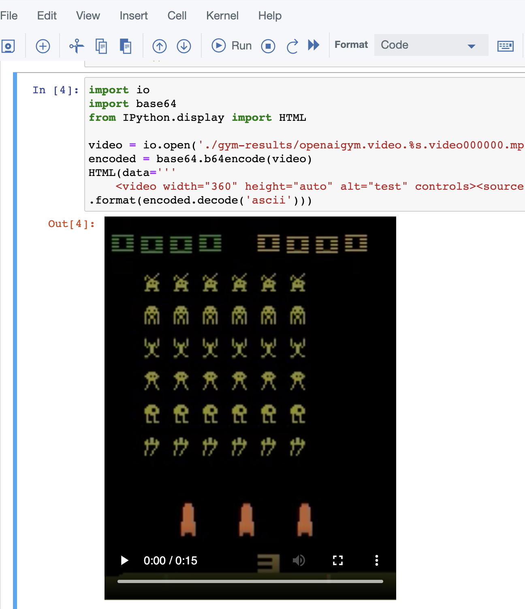

# Extra Stuff OpenAI - DO NOT USE, SITE UNDER CONTRUCTION !!!!  
  
    
# Lab - running Reinforcement Learning models on Watson Studio  

  

Wanna return to the agenda page?  [CLICK HERE](../README.md)
  
  
  

> IMPORTANT: The most important thing for you right now is to take your time and do not rush through the scripts. Rather, try to understand new concepts and let them sink in. You can finish the lab during the workshop but if don't it's OK. You will be able to finish it later.  You can also continue with other labs that you find on the way. This is how any skill is built - by doing. 
  
    
      
# 1. Run Reinforcement Learning models on Watson Studio

Prerequisites for this lab are:

- [ ] Existing **IBM Cloud** account 

- [ ] Started instance of **Watson Studio** on your **IBM Cloud** account 

Description...

> If you haven't registered to IBM Cloud or haven't started Watson Studio intance, please proceed to Preparation Lab.

To do the AutoAI experiment lab click [this link](https://www.ibm.com/cloud/garage/dte/tutorial/ibmr-watson-studio-mldl-made-easy) and follow instructions in **Task 1** and **Task 2** sections. If you get the flow feel free to do all tasks later on after the workshop.
  
    
      
      
# End of AutoAI experiment
---